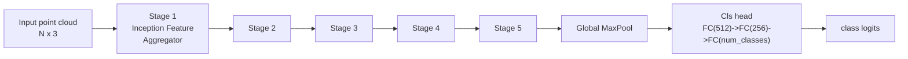
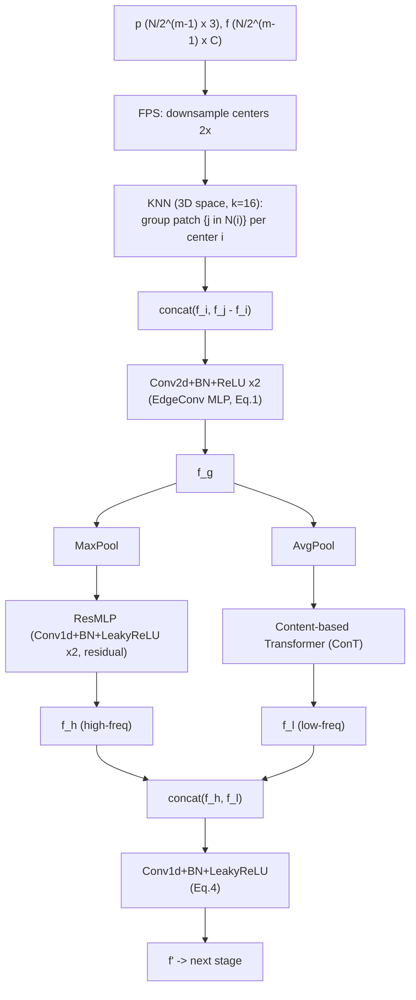

# PointConT: Point Cloud Classification Using Content-Based Transformer via Clustering in Feature Space

Technical implementation reference. Source: Liu, Tian, Lv, Li, Wang — *IEEE/CAA JAS*, 2024. Cross-checked against the official code (`yahuiliu99/PointConT`, files `models/PointConT.py`, `models/PointConT_util.py`, `models/ResMLP.py`, `main_cls.py`, `data_util.py`, `util.py`, `config/*.yaml`).

**TL;DR.** PointConT is a 5-stage hierarchical point-cloud backbone. Each stage: FPS-downsample centers → KNN-group local patches in 3D → EdgeConv-style MLP → split into a high-frequency branch (MaxPool + residual MLP) and a low-frequency branch (AvgPool + a custom "content-based" Transformer) → concatenate → MLP. The novelty is entirely inside the low-frequency branch: instead of attention over spatial neighbors, queries are recursively split in half ("balanced binary clustering") by feature similarity into equal-size, non-overlapping clusters, and a lightweight **vector attention is computed independently within each cluster**. This turns quadratic global attention into linear-in-*S* local attention, where "local" means *content-adjacent*, not *spatially adjacent*.

---

## 1. Core idea

Standard local-attention point Transformers (Point Transformer, Stratified Transformer) define locality in **3D space** (k-NN or cubic windows). This misses long-range but content-similar structures (e.g., both wingtips of an airplane). PointConT instead defines locality in **feature space**: at every block, points are clustered by feature similarity (not position) into equal-sized, non-overlapping groups, and self-attention is computed only within each group. Because group membership depends on the *current* feature content, it changes at every stage and every attention head, giving the effective receptive field global reach at local cost (paper Fig. 1, Fig. 5, Fig. 6).

---

## 2. Overall architecture (paper Fig. 2)



| Stage | Points | Feature dim | Down-sample ratio |
|---|---|---|---|
| Input | N (=1024) | 3 | — |
| 1 | N/2 | 64 | 2x |
| 2 | N/4 | 128 | 2x |
| 3 | N/8 | 256 | 2x |
| 4 | N/16 | **512** | 2x |
| 5 | N/32 | 1024 | 2x |

> Erratum: the published Fig. 2 prints "N/16 x 521"; this is a typo for **512** (consistent with `patch_dim` doubling and with the released config, see §6).

Backbone = a stack of 5 **Inception Feature Aggregator** blocks, each halving point count and doubling channel width. Head = global max-pool over the final N/32 points, then 2 FC layers (with BN+LeakyReLU+Dropout, `ResMLP.MLPBlockFC`) and a final `Linear` to `num_classes`.

**Implementation note:** the paper's text describes "Stage 1" as special (embeds raw xyz into the first feature space). The reference code does **not** special-case it: Stage 1 is just the general block with input feature = raw 3D coordinates (so `in_channel = 2*3 = 6` after the `||f_i, f_j-f_i||` concat). All 5 stages share one code path.

---

## 3. Inception Feature Aggregator (paper Fig. 3, one per stage)

Given prior-stage point coordinates `p` and features `f`:



Equations (S = N/2^m points at this stage, k = patch size, C' = 2^(m-2)C):

1. **EdgeConv MLP** (adapted from DGCNN, but KNN done in **3D space**, not feature space):
   `f_g = MLP(concat(f_i, f_j - f_i))`, `f_g in R^{S x k x 2C'}` — 2x(Conv2d → BatchNorm2d → ReLU).
2. **High-frequency branch:** `f_h = ResMLP(MaxPool(f_g))`.
3. **Low-frequency branch:** `f_l = ConT(AvgPool(f_g))` — the content-based Transformer described in §4, applied to the *averaged* per-patch feature (this is the input token to attention, one token per center point).
4. **Fusion:** `f' = MLP(concat(f_h, f_l))` — 1x(Conv1d → BatchNorm1d → LeakyReLU).

Rationale (from the paper's ablation, Table III/discussion): max-pooling preserves high-frequency detail, average-pooling+Transformer acts as a low-pass filter; doing them **in parallel** (Inception-style) and concatenating clearly outperforms doing them serially (chaining ConT directly after MaxPool, no AvgPool) — Exp. V in Table III shows a large drop without the parallel/AvgPool design.

---

## 4. Content-based Transformer, "ConT" (paper Fig. 4, Section III-C)

Input: `X in R^{S x d}` (one token per center point of the current stage, S = number of patches). Standard linear projections: `Q = X W_Q`, `K = X W_K`, `V = X W_V`, split into `num_heads` heads (`d_head = d / num_heads`).

### 4.1 Hierarchical binary clustering (Eq. 6)

Goal: partition the S query tokens into **L equal-size, non-overlapping** clusters of size `local_size = S/L` (an ablated hyperparameter, best value 16, Table V), independently **per head** and **per block**. Unlike K-means, cluster sizes are always exactly equal — required so the subsequent attention can be computed as one batched, shape-static tensor op (parallel on GPU).

```text
function hierarchical_binary_cluster(Q):            # Q: [S, d_head], operates per (batch, head)
    idx = identity_permutation(S)
    n_iters = log2(L)                                 # L = S / local_size
    group = Q                                          # current working set, starts as 1 group of size S
    for iteration in 1..n_iters:
        for each current group g of size n (initially n = S):
            split g in half by position -> g1 (first n/2), g2 (last n/2)
            c1 = mean(g1); c2 = mean(g2)                # Eq. 6 cluster centroids
            for each token q in g:
                r(q) = dist(q, c1) / dist(q, c2)         # Eq. 6 distance ratio (+1 smoothing in code)
            sort tokens in g by r(q) ascending
            g1' = first n/2 sorted tokens  (closer to c1)
            g2' = last  n/2 sorted tokens  (closer to c2)
            record the permutation applied to idx
            g1, g2 become two new groups of size n/2 for the next iteration
    # after n_iters recursive halvings -> L groups of size local_size each,
    # ordered contiguously in `idx`
    return idx   # permutation that reorders the S tokens into L contiguous clusters
```

This is exactly Eq. 6 applied recursively: start with 1 group of all S queries, split into 2 (via distance ratio to the group's own two half-means, then sort+bisect), then split each of those into 2 again, `n = log2(L)` times total, ending with L groups of `S/L` tokens each. **K, V are gathered with the exact same permutation** ("share index" in Fig. 4) so that `Q_i, K_i, V_i` for cluster *i* all refer to the same S/L tokens.

> **Distance metric subtlety (worth flagging for reproduction):** Table VI in the paper reports that raw Euclidean distance in feature space beats cosine similarity. However, the released code L2-normalizes both the token (`q_norm`) and the two centroids (`q_avg`) with `F.normalize(..., dim=-1)` *before* calling `square_distance`. Squared Euclidean distance between unit vectors is a monotonic function of cosine similarity (`||a-b||^2 = 2 - 2 cos(a,b)`), so the shipped default path is actually ranking by **cosine similarity**, not raw feature-space Euclidean distance. If you want to faithfully reproduce the "Euclidean distance" ablation row, drop the two `F.normalize` calls and compute `square_distance` on the raw `q_pre`/`q_avg` vectors instead.

### 4.2 Attention within each cluster (Eq. 5, 7, 8)

Two SA variants are defined in the paper; PointConT uses vector attention by default (ablated in Table VII: vector > scalar > none):

```
scalar attention (Eq.7, not used by default):  SA = Softmax(Q K^T / sqrt(d)) V        # full S x S matrix
vector attention (Eq.8, used by default):      SA = Softmax((Q - K) / sqrt(d)) (*) V   # (*) = elementwise
```

> **Critical implementation detail — read carefully.** Because `Q, K, V in R^{S x d}` in Eq. 8 (same shape, no transpose/matmul), the subtraction `Q - K` is **elementwise across the token axis**, not a pairwise `S x S` comparison. The reference implementation confirms this: `attn = (q - k) * scale; attn = softmax(attn, dim=-1)` where `dim=-1` is the **channel** axis (`d_head`), not the token axis, and the aggregation is `out = attn (elementwise*) v` (`torch.einsum('bhld,bhld->bhld', attn, v)` — same index `l` on both sides, i.e. a Hadamard product, **not a contraction/sum over tokens**). So within a cluster there is **no token-to-token mixing** from the SA formula itself — every token is re-weighted per-channel using its *own* Q/K difference, then gated onto its *own* V. Cross-token information flow at this stage comes only from: (a) the shared linear projections `W_Q, W_K, W_V`, and (b) the surrounding EdgeConv step, which already mixed each point with its k=16 3D neighbors before ConT ever sees it. If you implement "self-attention within each cluster" as a literal `softmax(QK^T)` matmul (which is what most people assume "self-attention" means), you will **not** reproduce this architecture — you'd be implementing Eq. 7 (scalar attention) applied locally, a legitimate but different, ablated variant (Table VII, 87.9–92.9%, slightly worse than the vector-attention default).

After per-cluster attention, the `nl` clusters are concatenated back in cluster order, then **un-permuted** using the inverse of the clustering permutation from §4.1 ("merge and reverse" in Fig. 4) so tokens are restored to their original order. Finally: output projection `Linear(d,d)` + dropout, then a **residual connection** `x + proj(attn_out)`.

Multi-head: `Q,K,V` projections and the *entire* clustering procedure (§4.1) are computed **independently per head** — different heads generally produce different clusterings of the same S tokens (paper Fig. 5).

### 4.3 Complexity (Eq. 9)

For S tokens, feature dim d, k neighbors (local spatial attention baseline):

| Attention scheme | Complexity |
|---|---|
| Local MSA (spatial k-NN window, scalar) | `4Skd^2 + 2Sk^2 d` |
| Point Transformer (spatial, vector) | `4Skd^2 + 2Skd` |
| **PointConT (content clusters, vector)** | **`4Sd^2 + 2Sd`** |

Non-overlapping clustering removes the `k`-dependence entirely (no need to gather a neighbor set per query — every token belongs to exactly one cluster), which is the main efficiency win over both classical global attention and spatial local attention.

---

## 5. Classification head

```
features   [B, N/32, 1024]   (output of Stage 5)
   -> max over the point axis            -> [B, 1024]      (Global MaxPool, Fig. 2)
   -> FC(1024->512) + BN + LeakyReLU(0.2) + Dropout(p)
   -> FC(512->256)  + BN + LeakyReLU(0.2) + Dropout(p)
   -> Linear(256 -> num_classes)                            (raw logits)
```

---

## 6. Hyperparameters (as shipped, `config/cls.yaml` + `config/db/*.yaml`)

| Param | Value | Notes |
|---|---|---|
| `num_points` (N) | 1024 | input points per sample |
| number of stages | 5 | ablated in Table IV; 5 is optimal, 6 overfits/degrades |
| `patch_dim` (channel width per stage) | `[3, 64, 128, 256, 512, 1024]` | stage 0 = input channels |
| `down_ratio` | `[2, 4, 8, 16, 32]` | cumulative FPS down-sample vs. N |
| `patch_size` (k, KNN neighbors per patch, Eq. 1) | `[16, 16, 16, 16, 16]` | same k at every stage |
| `local_size` (cluster size, ConT) | `[16, 16, 16, 16, 16]` | ablated in Table V; 16 is optimal (8 and 32 both worse) |
| `num_heads` | 4 | shared across all stages in the released config |
| `dropout` | 0.5 | classifier head only |
| similarity metric for clustering | Euclidean distance nominally (see §4.1 caveat re: normalization) | ablated in Table VI |
| attention variant | vector attention (Eq. 8) | ablated in Table VII |

---

## 7. Training recipe

| Item | ModelNet40 | ScanObjectNN (PB_T50_RS) |
|---|---|---|
| classes | 40 | 15 |
| batch size (train / test) | 32 / 16 | 64 / 32 |
| epochs | 300 | 400 |
| optimizer | SGD, momentum 0.9, weight decay 1e-4 | same |
| **effective LR** | `lr * 100` when `use_sgd=True` — config sets `lr=1e-3`, so the **actual** SGD LR is **0.1**, not 0.001 (see `main_cls.py`: `optim.SGD(..., lr=args.lr*100, ...)`) | same |
| LR schedule | Cosine annealing to `eta_min=1e-3` over `epochs`, with 10-epoch linear warmup (`GradualWarmupScheduler`) | same |
| loss | cross-entropy with label smoothing, `eps=0.2` (see `util.cal_loss`) | same |
| gradient clipping | `clip_grad_norm_(model.parameters(), max_norm=1)` | same |
| augmentation | RSMix (`beta=1.0`, `rsmix_prob=0.5`, `rsmix_nsample=512`) + random anisotropic scale (`[2/3, 3/2]`) + translate (`[-0.2, 0.2]`) + random point-order shuffle, train split only | same |
| seed | 9344 (fixed for full determinism: `cudnn.deterministic=True`, `cudnn.benchmark=False`) | same |

`subset_fraction` (default 0.1 in `config/cls.yaml`, stratified per-class subsampling of the dataset) is a **local convenience addition to this repo copy, not part of the original paper** — useful for fast iteration/debugging, not for reproducing the reported numbers (use `subset_fraction=1.0` / omit it for full-data runs).

---

## 8. Datasets

- **ModelNet40**: 12,308 synthetic CAD models, 40 categories, 9,840 train / 2,468 test, sampled to 1,024 points, HDF5 shards (`modelnet40_ply_hdf5_2048`).
- **ScanObjectNN**: ~15k real-world scanned objects, 15 categories, noisy/occluded/not axis-aligned. Paper reports the hardest official variant, **PB_T50_RS** (`*_objectdataset_augmentedrot_scale75.h5`), main split.

---

## 9. Reported results (for sanity-checking a reproduction)

| Dataset | Metric | Value |
|---|---|---|
| ModelNet40 | Overall Accuracy | 93.5% |
| ScanObjectNN (PB_T50_RS) | OA (no voting) | 88.0% |
| ScanObjectNN (PB_T50_RS) | OA (10-view voting) | 90.3% |
| ScanObjectNN (PB_T50_RS) | mAcc (no voting / voting) | 86.0% / 88.5% |

Component ablation (Table III, OA): removing average-pooling from the low-freq branch (i.e., feeding ConT directly from MaxPool output, serial instead of parallel) drops ModelNet40 92.9→~92.8 and ScanObjectNN more sharply (87.3→87.2, and the no-ConT variant drops to 81.0% on ScanObjectNN) — the parallel high/low-frequency split is the single most load-bearing design choice, more so than the attention mechanism itself.

---

## 10. Implementation checklist (suggested build order)

1. Data loading + augmentation (`translate_pointcloud`, RSMix) — get a `[B,1024,3]` tensor batch.
2. **FPS + KNN** utility (`Point2Patch`): furthest-point sampling for centers, brute-force/kNN search in 3D for patch members. (Reference uses the CUDA `pointnet2_ops` FPS kernel; a pure-PyTorch farthest-point sampler works but is slower.)
3. **EdgeConv MLP** (`PatchAbstraction`): gather center + neighbor features, concat `[f_i, f_j-f_i]`, 2x(Conv2d+BN+ReLU).
4. **High-freq branch**: max over neighbors, then a residual MLP (`ResMLPBlock1D`: Conv1d+BN+LeakyReLU, Conv1d+BN, `+x`, LeakyReLU).
5. **Low-freq branch**: mean over neighbors, then `ConT`:
   a. Linear QKV projection, split into heads.
   b. Hierarchical binary clustering of Q per head (§4.1) — get a permutation index.
   c. Gather K, V with the same permutation.
   d. Reshape into `(clusters, cluster_size, d_head)` and compute **elementwise** vector attention (§4.2) — do **not** implement a pairwise `S x S` matmul here.
   e. Un-permute back to original token order, output projection, residual add.
6. **Fusion**: concat high/low branch outputs, 1x(Conv1d+BN+LeakyReLU).
7. Stack 5 of the above (channel/point schedule from §6), then global max-pool + 2-layer FC head.
8. Loss = label-smoothed cross-entropy (`eps=0.2`); optimizer = SGD with the `lr*100` quirk *or* switch to Adam with `lr` as given (no multiplier) if you prefer not to replicate that quirk exactly.

### Gotchas / easy-to-miss details

- Vector attention here is **elementwise per token**, not pairwise self-attention — see the boxed warning in §4.2. This is the single easiest thing to get wrong.
- The clustering distance in the shipped code is effectively **cosine-similarity-based** (vectors normalized before `square_distance`), not raw Euclidean distance, despite Table VI's framing — see §4.1.
- Clusters must always be exactly equal size and a power-of-2 count (`S` must be divisible into `L = S/local_size` clusters via `log2(L)` recursive halvings) — pad or choose `S`/`local_size` accordingly if adapting to a different point count.
- `ConT.__init__` exposes an unused `kmeans` flag (stored but never branched on in `forward`) — it's dead/vestigial in this version; the hierarchical binary-clustering path always runs.
- FPS/KNN neighbor search is done in **3D coordinate space** at every stage (not in feature space, unlike DGCNN's EdgeConv) — only the ConT clustering step operates in feature space.
- Each stage applies **ConT exactly once** (a single attention block per stage), not a repeated multi-layer Transformer encoder.
- SGD's effective LR is `lr * 100` in the reference config/code — a subtle multiplier that's easy to silently drop when refactoring.

---

## References

- Paper: Liu, Y., Tian, B., Lv, Y., Li, L., Wang, F.-Y. "Point Cloud Classification Using Content-Based Transformer via Clustering in Feature Space." *IEEE/CAA Journal of Automatica Sinica*, 11(1), 231–239, 2024. [arXiv:2303.04599](https://arxiv.org/abs/2303.04599)
- Code: https://github.com/yahuiliu99/PointConT
